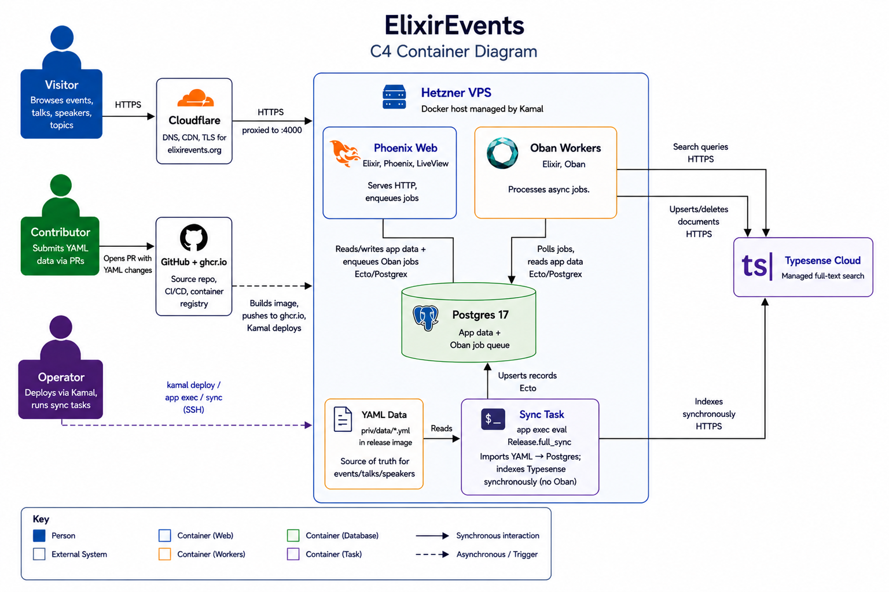

# ElixirEvents


Community directory for Elixir & BEAM conferences, talks, speakers, and topics.

Live at [elixirevents.org](https://elixirevents.org).

## Local Setup

Requirements: Elixir, Erlang, and PostgreSQL.

```bash
git clone https://github.com/elixirevents/elixirevents.git
cd elixirevents
mix setup
mix phx.server
```

Visit [localhost:4000](http://localhost:4000).

That's it. `mix setup` installs dependencies, creates the database, runs migrations, imports all YAML event data, and builds assets.

## Working with Data

All event data lives in `priv/data/` as YAML files. To add events, speakers, or talks, edit the YAML and open a PR. See the [contribute page](https://elixirevents.org/contribute) for details.

After editing YAML files, validate your changes:

```bash
mix elixir_events.validate
```

This checks YAML syntax, required fields, slug formats, duplicates, and cross-file references — no database needed. It runs in CI too, so catching issues locally saves a round-trip.

To re-import data after making YAML changes:

```bash
mix elixir_events.import
```

This is idempotent — safe to run multiple times. To start completely fresh, `mix ecto.reset` will drop the database, recreate it, and import everything.

You can also auto-fix common YAML issues (bad slugs, quoting problems):

```bash
mix elixir_events.data.fix        # apply fixes
mix elixir_events.data.fix --dry-run  # preview without changing files
```

## Search

Search is powered by [Typesense](https://typesense.org). Records are automatically synced to Typesense on every insert, update, and delete — including during deployment data imports. Under normal operation, no manual intervention is needed.

If search results get out of sync (e.g. after a failed deploy, manual database changes, or Typesense downtime), trigger a reindex from your machine:

```bash
kamal reindex
```

Or against a specific collection from the console:

```bash
kamal console
```

```elixir
ElixirEvents.Search.reindex("events")
ElixirEvents.Search.reindex("talks")
ElixirEvents.Search.reindex("profiles")
ElixirEvents.Search.reindex("topics")
ElixirEvents.Search.reindex("event_series")
```

Reindex jobs run asynchronously via Oban.

## Architecture



## Deployment

Production runs on [Kamal 2](https://kamal-deploy.org). Deploys are automated: push to `main`, GitHub Actions builds the image and runs `kamal deploy`.

The release uses two roles on the same host:

- **web** — serves HTTP, does not process Oban jobs (`OBAN_QUEUES=none`)
- **workers** — processes Oban jobs, no HTTP

This keeps long-running jobs from impacting request latency.

### Common operations (maintainers only)

The following commands are for maintainers with SSH access to the production host and a populated `.kamal/secrets` file. Contributors don't need any of this — see [Local Setup](#local-setup) and [Working with Data](#working-with-data) for the developer workflow.

Aliases are defined in `config/deploy.yml`:

| Command | What it does |
|---|---|
| `kamal console` | Remote IEx shell into the running web node |
| `kamal shell` | Bash shell inside the web container |
| `kamal logs` | Tail application logs |
| `kamal errors` | Tail logs filtered to errors / exceptions |
| `kamal sync` | Re-import all YAML data (`Release.full_sync()`) |
| `kamal reindex` | Enqueue full Typesense reindex of every collection |
| `kamal db` | `psql` into the production database |
| `kamal db-dump > backup.dump` | Stream a `pg_dump` to your machine |
| `kamal restart` | Reboot the app containers |

## Contributing

PRs welcome for data additions, bug fixes, tests, and code improvements. Run `mix test` and `mix elixir_events.validate` before submitting. See [CONTRIBUTING](https://elixirevents.org/contribute).

## Credits

Thank you [AppSignal](https://www.appsignal.com) for sponsoring application monitoring and error tracking for ElixirEvents.

Thank you [Typesense](https://typesense.org) for sponsoring a Typesense Cloud cluster that powers the search functionality.

## License

[MIT](LICENSE)
